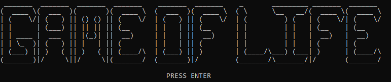
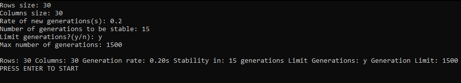
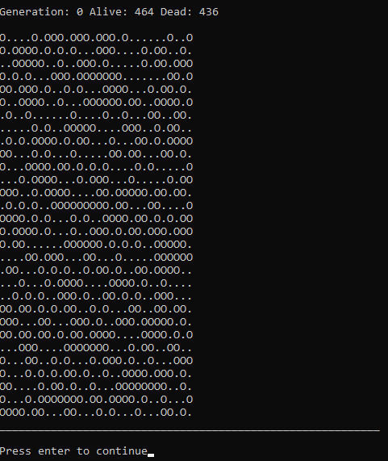
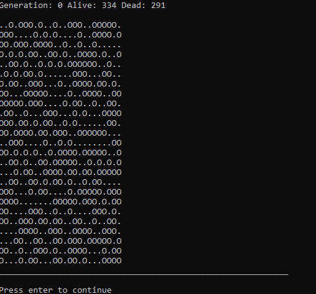

# Game of Life

A Game of Life program made using C, with some aditional 'quality of life' features.

## Table of contents
* [Introduction](#introduction)
* [Features](#features)
* [Status](#status)
* [How to Use It](#how-to-use-it)
* [Example](#example)

## Introduction

Conway's Game of Life problem is known by many and this is a code implementing it. Using the C language, this serves as a simple yet fun personal project. This version has some menu options to make the program a little bit more interactive.

## Features

- Define the maximum number of generations
* Choose the starting size of the cells matrix
+ Limit how many times new generations will be created after the population remains stagnated
- A cool 'Title Screen'

## Status

This code is already completed, I do not intend to further modify it and no more features will be added since it was made as a simple exercize.

## How to Use It

Just compile the main.c file and run the program. Make sure to follow the menu options and that's it.

## Example

**Title Screen:**

___________________________________

**Exmple of Inputs:**

___________________________________

**First Execution Screen:**

___________________________________

**Execution Example:**

___________________________________
